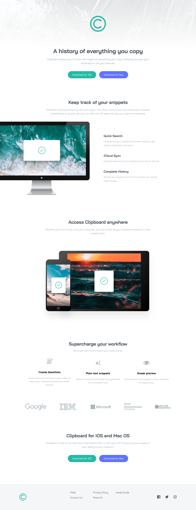
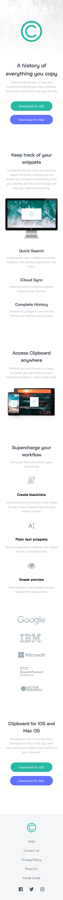

# Frontend Mentor - Clipboard landing page Solution

This is a solution to the [Clipboard landing page challenge on Frontend Mentor](https://www.frontendmentor.io/challenges/clipboard-landing-page-5cc9bccd6c4c91111378ecb9).

## Table of Contents

- [Overview](#overview)
  - [The Challenge](#the-challenge)
  - [Screenshot](#screenshot)
- [My Process](#my-process)
  - [Built With](#built-with)
  - [What I Learned](#what-i-learned)
  - [Continued Development](#continued-development)
  - [Useful Resources](#useful-resources)
- [Author](#author)

## Overview

### The Challenge

Users should be able to:

- View the optimal layout for the site depending on their device's screen size.
- See hover and focus states for all interactive elements on the page.

### Screenshot

#### Desktop



#### Mobile



## My Process

### Built With

- Google Fonts
- Semantic HTML5 markup
- Responsive design
- CSS custom properties
- CSS Flex
- CSS Grid
- CSS Filter
- CSS order
- CSS transition

### What I Learned

While working on this project, I improved in:

- Using **CSS Flex** to create complex, responsive layouts.
- Applying **mobile-first design principles** to ensure the site looks great on all devices.
- Using **CSS custom properties** (variables) to manage colors and typography efficiently.
- Converting hex color code to `CSS Filter` property for image coloring.
- Dynamic Navigation Layout with `CSS Order`.

Here are some code snippets I'm proud of:

```css
.footer__social img:hover {
  cursor: pointer;
  filter: invert(55%) sepia(96%) saturate(324%) hue-rotate(121deg) brightness(
      91%
    ) contrast(94%);
}

.footer__nav {
  display: flex;
  flex-direction: column;
  flex-wrap: wrap;
  height: 100px;
  gap: 10px;
  text-align: left;
}

.footer__link {
  width: 50%;
}

.footer__link:nth-child(1) {
  /* FAQs */
  order: 1;
}

.footer__link:nth-child(2) {
  /* Contact Us */
  order: 2;
}
```

### Continued Development

In future projects, I’d like to focus on:

- Exploring **CSS animations** to enhance user experience.
- Learning **JavaScript** to add interactivity to my projects.

### Useful Resources

- [CSS reset](https://www.joshwcomeau.com/css/custom-css-reset/) -
  A functional set of custom baseline styles.
- [Google Fonts](https://fonts.google.com/) - For finding and integrating web fonts.
- [CSS Filter Generator](https://codepen.io/sosuke/pen/Pjoqqp) - For practicing and improving front-end skills.
- [Frontend Mentor](https://www.frontendmentor.io/) - For converting hex color code to CSS Filter property for image coloring.

## Author

- Frontend Mentor - [@shishinyyy](https://www.frontendmentor.io/profile/Shishinyyy)
- Twitter - [@shish12\_](https://x.com/shish12_)
